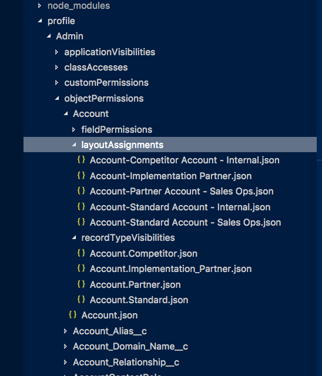

Profile Decomposition
======

PDecompose Plugin

EXAMPLES
```
  $ ./bin/run profile:decompose
     A decomposed profile in a `profile` folder.
```


_See code: [src/commands/profile/decompse.ts](https://github.com/dcarroll/survey/blob/v0.0.0/src/commands/profile/decompose.ts)_
